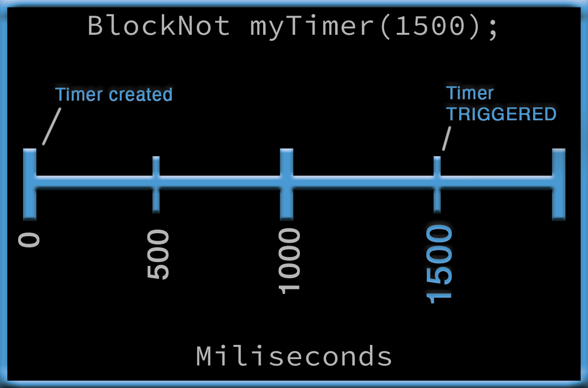
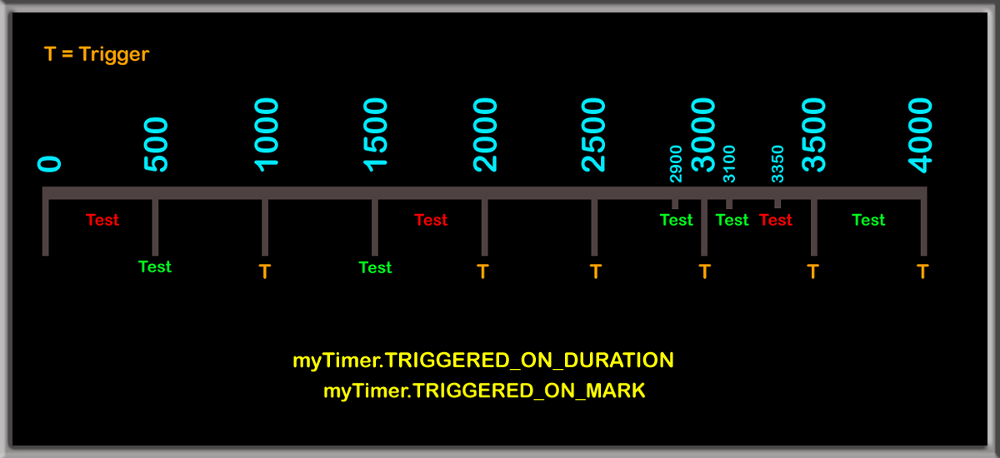
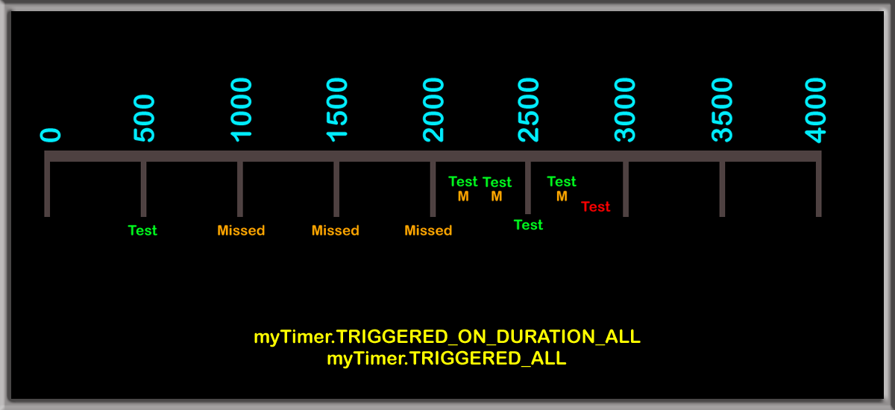

# BlockNot Arduino Library
This library enables you to create non-blocking timers using simple, common sense terms which simplifies the reading and writing of your code. It offers, among several things, convenient timer functionality, but most of all ... it gets you away from blocking methods - like delay() - as a means of managing events in your code.

**Non-Blocking is the proper way to implement timing events in Arduino code and BlockNot makes it easy!**
# Table of Contents
<!-- TOC -->
* [Quick Start](#quick-start)
* [Theory behind BlockNot](#theory-behind-blocknot)
* [How To Use BlockNot](#how-to-use-blocknot)
  * [The Trigger](#the-trigger)
    * [One Time Trigger](#one-time-trigger)
    * [Triggered OnDuration](#triggered-onduration)
        * [Default Behavior](#default-behavior)
      * [OnDuration(ALL)](#onduration--all-)
  * [The Reset](#the-reset)
    * [Global Reset](#global-reset)
  * [Time Unit Options](#time-unit-options)
    * [Default](#default)
    * [Other Units](#other-units)
      * [BlockNot Assumptions](#blocknot-assumptions)
      * [Microseconds](#microseconds)
    * [Converting Units](#converting-units)
    * [Changing Values](#changing-values)
    * [Switching Base Units](#switching-base-units)
  * [Start / Stop](#start--stop)
    * [Return Values on Stopped Timers](#return-values-on-stopped-timers)
  * [Summary](#summary)
* [Examples](#examples)
    * [BlockNotBlink](#blocknotblink)
    * [BlockNotBlinkParty](#blocknotblinkparty)
    * [DurationTrigger](#durationtrigger)
    * [OnWithOffTimers](#onwithofftimers)
    * [ResetAll](#resetall)
    * [TimersRules](#timersrules)
* [Library](#library)
  * [Methods](#methods)
  * [Macros](#macros)
* [Discussion](#discussion)
  * [Memory](#memory)
  * [Rollover](#rollover)
* [Version Update Notes](#version-update-notes)
* [Suggestions](#suggestions)
<!-- TOC -->

# Quick Start
Here is an example of BlockNot's easiest and most common usage:

First, you crate the timer:
```C++ 
#include <BlockNot.h>   
BlockNot helloTimer(1300); //In Milliseconds    
```
**OR optionally** 

```C++ 
#include <BlockNot.h>   
BlockNot helloTimer(15, SECONDS); //Whole Seconds timer    
BlockNot helloTimer(120000, MICROSECONDS); //Microseconds timer    
```
Then, you just test it to see if it triggered.
```C++
   if (helloTimer.TRIGGERED) {  
      Serial.println("Hello World!"); 
   } 
 ``` 
 That is all you need to start using BlockNot. Keep reading to learn about other features of the library.  
  
    
# Theory behind BlockNot    
 This is a traditional non-blockling timer:  
  
```C++  
long someDuration = 1300;  
long startTime = millis();  
if (millis() - startTime >= someDuration) {  
        //Code to run after someDuration has passed.
 }  
```  

This does the same thing, only with much simpler code!
```C++  
if (myTimer.TRIGGERED) {  
        //Code to run after timer has triggered.
 }  
```  
The idea behind BlockNot is very simple. You create the timer, setting its duration when you declare it, then check on the timer in your looping code to see if it TRIGGERED. Or, you can check for other information such as how long until it will trigger, or how much time has passed since it last triggered or you can ask it what the current duration is, which might be useful in scenarios where you change the duration based on dynamic criteria.

For example, if you wanted to see if the timers duration has come to pass, but you don't want to reset the timer, you can use this method:
```C++  
if (myTimer.triggered(NO_RESET)) {}  
```  
OR, you can do it like this:
```C++  
if (myTimer.HAS_TRIGGERED) {}  
```  
They both do the same thing, but in terms of readability, the second example is the obvious choice. BlockNot has several easy to understand commands that make it very 'user-friendly' and make your code much more readable.

Here is a simple graph showing you how BlockNot timers work. What's important here is to realize that your code never stops executing while the timer is passing time.



# How To Use BlockNot
## The Trigger

BlockNot is all about the trigger event. When runners line up to start a race, it is a traditional practice 
for someone to stand next to the line and hold a gun in the air and pull the trigger when the race starts. 
That is the idea behind the TRIGGERED event in BlockNot. If your timer is set, for example, to 1300 milliseconds,
it will return true when you call the TRIGGERED event on or after 1300 milliseconds have passed ... there are
exceptions, however, as you will see which can be useful.  

```C++  
if (voltageReadTimer.TRIGGERED) {  
    readVoltage();
}  
```   

### One Time Trigger

I have personally found it quite handy in some scenarios, to be able to get a boolean true response after the
timer has triggered, but only once, so that the code which executes after getting a true response only executes
once and when the test comes up again in the loop, a response of false will be given until the timer has been
manually reset.

This kind of trigger is called FIRST_TRIGGER and you use it like this:
```C++  
if (myTimer.FIRST_TRIGGER) { my code }  
```  
That method will return true ONLY ONE TIME after the timer's duration has passed, but subsequent calls to
that method will return false **until you manually reset the timer** like this:
```C++  
myTimer.RESET;  
```  
Why would you need to do that? There are countless scenarios where that would be immediately useful.
I have used it with stepper motor projects where I want an idle stepper motor to be completely cut off
from any voltage when it has been idle for a certain length of time ... lets say 25 seconds.

So first, we define the timer
```C++  
BlockNot stepperSleepTimer (25, SECONDS);  
```  
Then, we reset the timer every time we use the motor:
```C++  
stepperSleepTimer.RESET;  
```  
Then, in your loop, you would put something like this:
```C++  
if (stepperSleepTimer.FIRST_TRIGGER) {  
     sleepStepper();
 }  
```  
So that if the stepper hasn't moved in the last 25 seconds, it will be put to sleep and that sleep routine
won't execute over and over again each time the loop encounters the check. Yet when the stepper is engaged again,
the sleep timer is reset and when it becomes idle again for 25 seconds, it is put to sleep. This helps efficiency 
in your program, and it conserves valuable CPU time.

### Triggered OnDuration

This topic is a little tricky to comprehend (myself included as I
wrote this method), but I have done my best to explain it as simply as possible.

There might be times when it becomes necessary to respect a timers trigger in the context of
its **duration**, so that when a timers trigger is checked, it then resets its ```startTime``` to a time that is
relative to its duration rather than simply resetting to the current value of ```micros()``` or ```millis()```.

```triggeredOnDuration()``` Does this with two optional results.

##### Default Behavior
Let's use a timer that is set to a duration of 500ms as our example.

You test it for TRIGGER by using either the macros or the method
```CPP
myTimer.TRIGGERED_ON_DURATION
myTimer.TRIGGERED_ON_MARK
myTimer.triggeredOnDuration()
```
BlockNot views the timer as having rigid trigger marks that happen exactly 500ms apart. So
if you check the timer - say 700ms after you start it, you will get a TRUE response and
it will trigger again in 300ms instead of 500ms because BlockNot will set the startTime
back to 500ms and not the current time of 700.

So lets say we are well into the passage of time, and you test for trigger at time index 2830 ...
BlockNot will return ```TRUE``` and then set the startTime back to 2500 so it will trigger again at 3000.

The idea is that you can have a timer that will provide the ability to run code on a consistent pulse where each pulse
happens exactly at every interval of time based on the timers duration, and you can have your code execute
as close to those 'pulse marks' as possible.

#### OnDuration(ALL)

```triggeredOnDuration(ALL)``` works exactly as ```triggeredOnDuration()``` EXCEPT that BlockNot
will continue to return a ```TRUE``` result until every missed mark is accounted for.

You can test for TRIGGERED using these macros or the method
```CPP
myTimer.TRIGGERED_ON_DURATION_ALL
myTimer.TRIGGERED_ALL
myTimer.triggeredOnDuration(ALL)
```
Continuing with our 500ms duration timer, if you test it at time index 1250 then again at
time index 1300, you will get a TRUE response for both tests, since you missed the first
mark at 500, but then tested after the second mark at 1000. If you tested again before
1500, you would get a ```FALSE``` response.

These graphs show you what will happen as time advances and you test for TRIGGERED
using this method.

A green Test means you tested and got TRUE while red means you got FALSE.

This is how the standard TRIGGERED event responds:


This visualises how ```TRIGGERED_ON_DURATION``` / ```TRIGGERED_ON_MARK``` works.



Notice how you can get a TRUE response immediately before and immediately after a trigger
event. BlockNot is giving you a TRUE response for the trigger that happened at time index
2500, then it gives a TRUE response for the trigger that happened at time index 3000. But
when you test again before 3500, you will get a FALSE response.

Here is how ```TRIGGERED_ON_DURATION_ALL``` / ```TRIGGERED_ALL``` works.



Notice you got FOUR consecutive TRUE results in a row. This is because you missed three triggers
, then you tested twice, then at a trigger point, then once again, and the 5th time you tested,
your test happened before the next trigger and all of the missed trigger events had been accounted
for, so you get a FALSE response.

A possible use case for the ALL trigger test would be when using a timer as a sync counter of sorts. And to explain that, I
am going to use an extreme example that should illustrate the point... Lets say that you have a project that
must automatically water plants at least six times every hour. It doesn't matter if the plants are watered every 10
minutes, or if they are watered once, then 15 minutes later, then again 5 minutes later etc., as long as they are
watered six times every hour.

We would define this timer as follows:
```CPP
BlockNot waterTimer = BlockNot(600, SECONDS); //10 minute duration
```

Let's also assume that your code is so busy doing other things, that it might not
be able to check the trigger on that timer - possibly even after two full durations have passed.
When you check the trigger using ```TRIGGERED_ALL```, that will cause BlockNot to continue giving
you a TRUE response until each missed trigger has been provided to you.

See the example sketch called **DurationTrigger** to see this method in action.

## The Reset

Resetting a timer is critical to performing repeated events at the right intervals. However, there may be times when you don't want this behavior. 

Resetting of a timer once it has triggered is the default behavior of BlockNot.
```C++  
if (myTimer.TRIGGERED) { my code }  
```  
Using TRIGGERED, the timer automatically resets, whereas if you do this:
```C++  
if (myTimer.HAS_TRIGGERED) { my code }   
```  
The startTime **does not reset** and that test will always come back true every time it is executed in your
code, as long as the timer's duration has passed. The exception of course would be using the FIRST_TRIGGER
method.

### Global Reset

Sometimes, having the ability to reset all of your timers at the exact same time is handy. There are situations,
for example, when you need things to happen in a specific timed order and to do so repeatedly. This is possible
by creating your timers then simply calling one method that resets them all simultaneously. 

You can reset all of your timers simultaneously by simply calling either the method or the macro:
```C++
resetAllTimers();
RESET_TIMERS;
```

When you call this method, it first captures the value of micros() or millis() then it assigns that
value to the startTime of every instantiated timer so that they all reset at precisely the exact 
same time. And don't worry, if you have a peppered mix of timers each with different base units (
milliseconds, microseconds etc.) BlockNot will use either millis() or micros() based on each timers 
individual - currently assigned base unit.

It should be noted that even if you have your project divided into multiple code files, the resetAll 
method will reset all timers across all of your code ... It is global to your entire project.

## Time Unit Options

### Default
When you declare your timers without specifying the units, they will default to millisecond timers, 
because milliseconds are the most commonly used time units in Arduino programming.

### Other Units
You can declare a timer to operate within any time unit you desire, as long as the time unit you desire is either SECONDS, MILLISECONDS or MICROSECONDS. 

For example, when you only need **second** precision, you can declare your timer as a SECONDS timer. It
can be much easier in terms of writing and reading your code, if you don't need milli or micro second
precision. It's much simpler to use 23 than 23000 when you only need to know about 23 seconds.

You instantiate your timers with other units like this: 
```C++
BlockNot myTimer(5, SECONDS);
BlockNot myTimer(14000, MICROSECONDS);
```
Under the hood, BlockNot calculates SECONDS and MILLISECONDS using the millis() method, where MICROSECOND
timers use the micros() method.

#### BlockNot Assumptions

When a timer is declared as a SECONDS, MILLISECONDS, or MICROSECONDS timer, the unit you choose is referred to as the timers **base units**.

You MUST interact with your timer, in the base units you declared it as or in the base units you switch it to (discussed below).

When you read values from your timer, by default, you will always get back a value that is in the
base units of the timer. 

For example, these
````C++
BloclNot myTimer(50000, MICROSECONDS);

myTimer.GET_START_TIME;
myTimer.getStartTime();
````
will always return a value in MICROSECONDS.

And

```C++
BloclNot myTimer(50000, SECONDS);

myTimer.GET_START_TIME;
myTimer.getStartTime();
```
will always return a value in SECONDS.

It needs to be noted that in a SECONDS timer, the numbers that are returned when seeking a value,
will ALWAYS be rounded DOWN. So if, for example, you have a SECONDS timer, and you request the value 
for the number of seconds remaining until the next trigger, and BlockNot calculates that value to be
8700 milliseconds. You will get 8 SECONDS back in response.

This shouldn't be a problem, because if you need fractional second accuracy, then use a millisecond timer.

#### Microseconds
MICROSECONDS are almost always used in situations when you need to reference time durations that 
are faster than a millisecond. Therefore, NEVER use a MICROSECONDS timer when you need to evaluate
time in durations longer than an hour, because the Arduino rolls the micros() counter after roughly
one hour (read discussion on rollover below) and BlockNot has no way of knowing how often that counter
rolls over. It can and will calculate durations accurately when a rollover happens in between TRIGGERED
events, but when more than one of these events happens in between TRIGGERED events, BlockNot will not
be able to know about those rollovers and your results will be inaccurate.

Realistically, you should never use a MICROSECONDS timer if your event durations are always longer
than one million microseconds, and certainly you should never use a MICROSECONDS timer for durations
longer than an hour. **If you need to track intervals of time that are longer than an hour, 
USE SECONDS OR MICROSECONDS!**

### Converting Units
Because program storage space is extremely valuable with microcontrollers, I decided to offer the
convert method as opposed to writing methods and macros for every option available where values
of interest might be needed. The convert method will convert from the units that your timer is
declared in, to whichever DESIRED units are passed into the method.

The convert method uses this structure
```C++
unsigned long desiredValue = myTimer.convert(valueOfInterest, UNIT_DESIRED);
```
- The number returned will always be an unsigned long.

- ```valueOfInterest``` MUST be an unsigned long, or a long that is not negative
- ```UNIT_DESIRED``` MUST be either ```SECONDS```, ```MILLISECONDS``` or ```MICROSECONDS```

For example, lets say that we have declared a timer as a MILLISECONDS timer, but we are interested
in knowing how many SECONDS or MICROSECONDS remain until the timer triggers again. We can get those
values in different units like this:
```C++
value = myTimer.convert(myTimer.TIME_TILL_TRIGGER, SECONDS);
value = myTimer.convert(myTimer.TIME_TILL_TRIGGER, MICROSECONDS);
```

The ```convert()``` method can be used to convert ANY value into whichever units you need, but 
realize that the value you pass into the method will be assumed to be in the timers base units.

Any of these methods can be passed into the convert() method to obtain their values in whichever
unit you desire (desired units in this example were chosen randomly).
```C++
myTimer.convert(myTimer.getTimeUntilTrigger(), SECONDS)
myTimer.convert(myTimer.getNextTriggerTime(), MILLISECONDS)
myTimer.convert(myTimer.getStartTime(), SECONDS)
myTimer.convert(myTimer.getDuration(), MICROSECONDS)
myTimer.convert(myTimer.getTimeSinceLastReset(), MILLISECONDS)
```
Here is what each of these methods provides:
- ```getTimeUntilTrigger()``` returns a value that is relative to the timer's duration. So if the duration is set to 1350ms, and it has been 500ms since it last triggered, the returned value will be 850ms
- ```getNextTriggerTime()``` will return a value that is relative to the microcontrollers internal micros() or millis() value, which will be the timers current startTime PLUS the timer's duration
- ```getStartTime()``` returns the value of the CPUs micros() or millis() method that was recorded as the timers current startTime
- ```getDuration()``` Simply returns the duration that is currently set in the timer (the duration you assign when you create the timer, or the one that you changed it to after the fact)
- ```getTimeSinceLastReset()``` returns a value that represents how much time has elapsed since the timer was last reset. It does not consider trigger events, but only the current startTime.
### Changing Values
When you need to change a timers' duration, or you need to add or subtract time to the timer's duration,
you MUST pass numbers into those arguments that are in the timers base unit.

So if, for example, you declared the timer as a SECONDS timer, and you want to change the duration to
be 10 seconds, you must do so like this
```C++
myTimer.setDuration(10);
```
And if you have declared a timer in MILLISECONDS, and you want to add or subtract 2300 milliseconds
to the timers duration
```C++
myTimer.addTime(2300);
myTimer.takeTime(2300);
```

### Switching Base Units
If you need to switch the timers base units, you can do so like this:
````C++
myTimer.switchTo(MICROSECONDS);
myTimer.switchTo(MILLISECONDS);
myTimer.switchTo(SECONDS);
````
Once you have changed the base units, then obviously, values returned from methods will be returned
in the new base unit, and values given to the timer will be assumed to be in the new base unit that 
you switched it to.

Using ```switchTo()``` is no different from originally declaring the timer in the base unit that you
switch it to.

Though I cannot imagine why anyone would want to do this, I included the feature for flexibility. 
Just know that however you declare the timers units, you must deal with it in those units, or use
the convert method to get your answers in different units.

## Start / Stop

You can stop a timer, then start it again as needed.

When a timer is stopped, any call to the timer that would return a boolean value will ALWAYS 
return false. And when you query the timer where a numeric value is supposed to be returned, 
it will return a ZERO by default, although you can change what number it returns for those 
methods, as long as the number you set is a positive number (BlockNot does not ever deal with 
negative numbers, since time in our universe always moves forward).

I've used STOP and START when stepping motors, where the delay between steps is defined in a
MICROSECONDS timer (where the duration is constantly changing based on the value of RPMs) but
when the RPMs are set to 0, then I simply STOP the timer and stepping  will not occur. When RPMs 
are above 0, then I START the timer and stepping resumes.

These methods will ALWAYS return false when a timer is stopped (for macro calls see the Macro 
section of this document):

*    **triggered()**
*    **notTriggered()**
*    **firstTrigger()**

These methods will return a ZERO by default when a timer is stopped (or whichever value you set as the return).
*    **getDuration()**
*    **getTimeUntilTrigger()**
*    **timeSinceLastReset()**

### Return Values on Stopped Timers

You can declare the return value when you create the timer (see the constructors in the .h file), OR,
once you create your timer, you simply set the value using this method:
```C++
setStoppedReturnValue(8675309);
```

What matters in this situation is that the default return value for any stopped timer is always ZERO unless you change
it, and the number you assign, once again, CANNOT BE NEGATIVE

You can start and stop a timer using these methods / macros.
```C++  
myTimer.START;  
myTimer.STOP;  
```  

And you can find out if the timer is running or not using either of these calls:
```C++  
if (myTimer.ISRUNNING) { my code; }  
if (myTimer.ISSTARTED) { my code; }  
if (myTimer.ISSTOPPED) { my code; }  
```  

You can also flip the state of the timer (if stopped, it will start; if started, it will stop):
```C++  
myTimer.TOGGLE;  
```  
Why would you want to just change the state with one line of code? Perhaps you have a toggle button that will toggle a timer to be started or stopped ... you can assign the one command to the button and everything is handled.

```C++
#define BUTTON_PRESSED digitalRead(BUTTON) == LOW

pinMode(BUTTON, INPUT_PULLUP);

if (BUTTON_PRESSED) {  
   myTimer.TOGGLE;
 }  
```  


## Summary

Well, that's BlockNot in a nutshell.

Simple, right?

BlockNot is a library intended to make the employment of non-blocking timers easy, 
intuitive, natural and obvious. It can be engaged with simple single word macros 
or by calling the methods directly.

There are more methods that allow you to affect change on your timers after instantiation and also methods to get info about your timers. You can change the duration of an existing timer in three different ways, you can reset the timer, or you can even find out how much time is left before the trigger event occurs, or find out how much time has passed since the timer last triggered.

# Examples

There are currently seven examples in the library.

### BlockNotBlink

This sketch does the same thing as the famous blink sketch, only it does it with BlockNot elegance and style.

### BlockNotBlinkParty

If you have a nano or an uno or equivalent laying around and four LEDs and some resistors, connect them to pins 9 - 12 and run this sketch. You will immediately see the benefit of non-blocking timers. You could never write a sketch that could do the same thing using the delay() command.  It would be impossible.

**Non-Blocking MATTERS!**

### DurationTrigger

Read the section above to get an idea of what TRIGGERED_ON_DURATION does, then load this example up and play around
with it. You can pause the loop from Terminal monitor by typing in p and hitting enter. Then if you wait for several
durations to pass, then un-pause the loop, you will see hoe BlockNot handles that feature.

### OnWithOffTimers

This example shows you how to use on and off timers to control anything that you need 
to have on for a certain length of time and also off for a certain length of time.

The example specifically blinks two LEDs such that they will always be in sync every 
6 seconds ... by this pattern:

### ResetAll

This sketch shows how all BlockNot timers defined in your sketch can be reset with a 
single line of code, rather than having to call reset() for each and every one 
separately. This comes in handy when all timers need to be reset at once, e.g. after 
the system clock has been adjusted from an external source (NTP or RTC, for example).

### TimersRules

This sketch has SIX timers created and running at the same time. There are various 
things happening at the trigger event of each timer. The expected behavior is explained 
in the out Strings to Serial. Read them, then let it run for a minute or so then stop 
your Serial monitor and look at the output. You should be able to look at the number of 
milliseconds that is given in each output, and compare the differences with the 
expected behavior and see that everything runs as it is expected to run.

For example, when LiteTimer triggers, you should soon after that see the output from 
stopAfterThreeTimer.  When you look at the number of milliseconds in each of their 
outputs, you can see that indeed it does trigger three seconds after being reset, 
but then it does not re-trigger until after it is reset again.

- Thanks to [@SteveRMann](https://github.com/SteveRMann) for kick-starting this example and working with me on fine-tuning it.
### MillisRolloverTest

  This sketch was added to demonstrate that BlockNot can and does properly calculate
  timer durations even when millis() rolls over. See the discussion further down
  on that topic.

  These examples barely scratch the surface of what you can accomplish with BlockNot.


# Library
## Methods
Below you will find the name of each method in the library and any arguments that it accepts. Below that list, you will find the names of the macros that are connected to each method along with the arguments that a given macro may or may not pass to the method. The macros are key to making your code simple.

** For any method call that resets a timer by default, the resetting behavior can be overridden by passing **NO_RESET** into the methods argument, the exception to this is the triggeredOnDuration() method, which exists because of the way it resets your timer, so overriding reset would make the method useless.

* **setDuration()** - Override the current timer duration and set it to a new value. This also resets the timer. If you need the timer to NOT reset, then pass arguments like this (newDuration, NO_RESET);
* **addTime()** - Adds the time you pass into the argument to the current duration value. This does NOT reset the timer. To also reset the timer, call the method like this **addTime(newTime, WITH_RESET);**
* **takeTime()** - The opposite effect of addTime(), same deal if you want to also reset the timer.
* **triggered()** - Returns true if the duration time has passed. Also resets the timer to the current ```micros()``` or ```millis()``` (override by passing NO_RESET as an argument).
* **triggeredOnDuration()** - See section above entitled **Triggered On Duration** for complete discussion.
* **notTriggered()** - Returns true if the trigger event has not happened yet.
* **firstTrigger()** - Returns true only once and only after the timer has triggered.
* **getNextTriggerTime()** - Returns an unsigned long of the next time that the timer will trigger. If it has triggered, it will return 0.
* **getTimeUntilTrigger()** - Returns an unsigned long with the number of microseconds remaining until the trigger event happens, converted to the timers base units.
* **getStartTime()** - Returns an unsigned long, The value of ```micros()``` or  ```millis()``` that was recorded at the last reset of the timer, converted to the timers currently assigned base unit.
* **getDuration()** - Returns an unsigned long, the duration that is currently set in the timer.
* **getUnits()** - Returns a String of the assigned base units of the timer; Seconds, Milliseconds or Microseconds.
* **getTimeSinceLastReset()** - Returns an unsigned long indicating how much time has passed since the timer was last reset or instantiated. Response will be in the base units of the timer.
* **setStoppedReturnValue()** - Lets you set the value returned for those methods that return numbers, when the timer is stopped. 
* **start()** - starts the timer (timers are started by default when you create them).
* **stop()** - stops the timer.
* **isRunning()** - returns true if the timer is not stopped.
* **isStopped()** - returns true if the timer is stopped.
* **toggle()** - Toggles the start and stopped state so that you only need to call this one method - like in a push button toggle situation.
* **switchTo()** - Change the timer from whichever base unit it currently is, over to SECONDS, MILLISECONDS or MICROSECONDS.
* **reset()** - Sets the start time of the timer to the current micros() or millis depending on its currently assigned base unit.
* **resetAllTimers()** - loops through all timers that you created and resets startTime to ```micros()``` or ```millis()``` depending on the timers currently assigned base unit, which is recorded once and applied to all timers, so they will all have the exact same startTime. See **Memory** section for further discussion.

## Macros

Here are the macro terms and the methods that they call along with any arguments they pass into the method:

* **TIME_PASSED** - getTimeSinceLastReset()
* **TIME_SINCE_RESET** - getTimeSinceLastReset()
* **ELAPSED** - getTimeSinceLastReset()
* **TIME_TILL_TRIGGER** - getTimeUntilTrigger()
* **TIME_REMAINING** - getTimeUntilTrigger()
* **REMAINING** - getTimeUntilTrigger()
* **DURATION** - getDuration()
* **GET_UNITS** - getUnits()
* **GET_START_TIME** - getStartTime()
* **DONE** - triggered()
* **TRIGGERED** - triggered()
* **TRIGGERED_ON_DURATION** - triggeredOnDuration()
* **TRIGGERED_ON_MARK** - triggeredOnDuration()
* **TRIGGERED_ON_DURATION_ALL** - triggeredOnDuration(ALL)
* **TRIGGERED_ALL** - triggeredOnDuration(ALL)
* **HAS_TRIGGERED** - triggered(NO_RESET)
* **NOT_DONE** - notTriggered()
* **NOT_TRIGGERED** - notTriggered()
* **FIRST_TRIGGER** - firstTrigger()
* **RESET** - reset()
* **RESET_TIMERS** - resetAllTimers()
* **START** - start()
* **STOP** - stop()
* **ISSTARTED** - isRunning()
* **ISRUNNING** - isRunning()
* **ISSTOPPED** - isRunning()
* **TOGGLE** - toggle()

If you can think of MACRO names that would make the reading and writing of you code more
natural and you think it would be a benefit to BlockNot, PLEASE either submit a pull
request or shoot me an email so that we can all work together to make this library the
best that it can possibly be.

Also, you can, of course create your own macros within your code. So, for example, let's 
say that you wanted a macro that overrides the default reset behavior in the setDuration() 
method, which by default, will change the duration of the timer to your new value and will 
also reset the timer. But lets say you want to change the duration WITHOUT resting the 
timer and you wanted that to be done with a word that makes more sense to you.

```C++  
#define QUICK_CHANGE(value) myTimer.setDuration(value, false)  
  
QUICK_CHANGE(3200);  
```  

The only difference here, is that you cannot make a macro that applies universally to all 
of your timers. You would need to make one macro for each timer you have created. This is
why it is better to submit a pull request or contact me with your ideas, so that all of us
who use BlockNot can benefit through continual improvement of the library.

# Discussion
## Memory

I have compiled BlockNot in a variety of scenarios. The only difference between each specific scenario is that I
would use traditional methods of implementing non-blocking timers, vs using BlockNot. In some scenarios, BlockNot
would cause the sketch to compile using less memory and in some scenarios, it would use a little more memory. 
Obviously your situation will be different depending on the size of your project, other libraries used etc.

If you're really struggling for memory space, try creating your timers using the manual method just to see if it
makes a difference or not using BlockNot.

In the interest of squeezing as much program space as possible, I have added the ability to disable BockNot's
global reset option, because it, by default, maintains an array of all instantiations of BlockNot which consumes
a little extra memory and if you don't need that feature and are hurting for memory space, then you can disable
it by passing NO_GLOBAL_RESET as the last argument into your first timer (You only need to pass that argument ONCE
and it will remain disabled for all timers created after that).

Examples of how to disable the feature:
````C++
BlockNot myTimer(3800, NO_GLOBAL_RESET);
BlockNot myTimer(15, SECONDS, NO_GLOBAL_RESET);
````

OR, you can optionally define some timers that are affected by the global reset method, then issue the NO_GLOBAL
argument into the next timer you create and that timer, and every timer created after it will not be included in the 
global reset option.

````C++
BlockNot timer1(1350);
BlockNot timer2(5,SECONDS);
BlockNot timer3(2670,NO_GLOBAL_RESET)
BlockNot timer4(3460); //not included in global reset
````

## Rollover
I've been contacted by a few people who have expressed concern with possible problems in timing when the
Arduino ```millis()``` or ```micros()``` counter rolls over (millis() at approximately 50 days and micros() at around 70 minutes) after power up.

First and foremost, **DON'T USE MICROSECOND TIMERS WHEN YOU CAN USE MILLISECONDS INSTEAD**

The whole issue about rollover **is not a concern at all**, because
of the way that BlockNot uses ```micros()``` and ```millis()```, your timers will still calculate properly even if the
```micros()``` or ```millis()``` value rolls over in the duration of a timer. I've tested BlockNot using simulated values to
artificially create a rollover scenario and I can tell you that it indeed works properly through a
rollover.

The reason it works has to do with the way CPUs handle binary numbers where there is no possibilty of the number 
being negative, and [this article](https://techexplorations.com/guides/arduino/programming/millis-rollover/) can explain it
in detail if you're interested.

I have added an example sketch called ```MillisRolloverTest.ino``` that will demonstrate how well
BlockNot calculates timer durations even through millis() rollovers, by artifically inflating the 
value of millis() and calculating the time difference between trigger events. There is more
discussion in that sketch.

# Version Update Notes

### 2.0.0
- Upgraded the entire library so that it can accommodate all time units down to microseconds. You can now use BlockNot as a SECONDS, MILLISECONDS or MICROSECONDS timer. An upgrade worthy of being labeled - 2.0

### 1.8.5
- Added TRIGGERED_ALL and TRIGGERED_ON_MARK macros.
- Completely re-wrote the triggeredOnDuration section of this README to condense the verbiage and simplify the concept. Also changed the graphs used to explain it so that they are **much easier** to understand.
- Added the **Millis() Rollover** section to this README

### 1.8.4
- Changed STARTED, RUNNING and STOPPED to ISSTARTED, ISRUNNING and ISSTOPPED to avoid conflict with some libraries. 

### 1.8.3
- small bug fixes

### 1.8.2
- This is HOPEFULLY the final re-working of the code for a while.
- Moved the Global Reset option back to being the default behavior, with having the ability to disable it as might be needed in rare cases when you need to squeeze as much program memory as you can. See the section above entitled MEMORY
- Most changes in this release were "under the hood" changes, with some public methods undergoing minor changes. This README has been properly updated to describe any changes accurately.

### 1.8.1
- In order to squeeze as much memory as possible out of the microcontroller, the resetAllTimers method will no longer be default behavior. Read the section above concerning its use.
- Added timeTillTrigger() method and TIME_TILL_TRIGGER macro ... they return a long that is the number of milliseconds that must transpire before the timer triggers again.
- Removed code that was intended to check for a millis() rollover which had some extra math in there that turned out to be completely unnecessary. BlockNot always was compliant with millis() rollover since the binary math that goes on under the hood makes the use of special code completely unnecessary.
- Cleaned out ambiguous and unnecessarily redundant macros... lean and mean is how we want to move forward.
- Renamed some private methods to keep them consistent with their purpose.

### 1.8.0
- MAJOR re-structuring of the library, breaking it up into a header and a code file as should have been done from the beginning. There was a violation of the One Definition Rule which has been solved with this update. Library should now compile in any standard C++ scenario.  Thank you  [@dpetican](https://github.com/dpetican) for pointing this out.

### 1.7.4
- Fixed a problem with the way that triggeredOnDuration was being calculated. It is now correct,
  and it also factors in any millis() rollover.

### 1.7.3
- Minor update
  - Now compatible with millis() value rollover back to zero every 49 days. 

### 1.7.2

- Minor update
  - Added start() method.
  - Added stop() method. 
  - Added **START** and **STOP** Macros. 
  - Removed restrictions preventing changes to a timer when it is stopped (disabled). Changes made to a stopped timer will now work.


### 1.7.1

- Minor code enhancements that improves efficiency thanks to [@bizprof](https://github.com/bizprof)

### 1.7.0

- Updated version to 1.7 - It just made sense to do a full step since the latest re-write, which includes cosmetic code changes as well as normalizing repetitive code, has been fairly substantial and it includes the new resetAllTimers() (RESET_TIMERS) method with its bug fixes.<BR>
- **Bug Fix** - Fixed bug where invoking resetAllTimers() was causing an accumulated time drift fot all timers.<BR>
- **triggeredOnDuration()** - method added so that when this method is called, the timer is reset by startTime + duration instead of using the current millis() value. This helps guarantee that the timer will only trigger exactly by the duration that you have set for the timer. That way, if you call a test for the timer being triggered and the time that you do the test is some time after the timer actually triggered, then it's new startTime will not include that extra time burned between the actual trigger time and the time when you called the test.<BR><BR> This will help you implement timers that trigger more accurately as long as your delays between the timer triggering and the time you test for the trigger are not consistently lapsed or else you will eventually run into the problem where the trigger will happen twice in a row ... run through the logic and think it through before you use this method.<BR><BR>The macro for calling this method is myTimer.TRIGGERED_ON_DURATION

### 1.6.7

- **Bug Fix** - Fixed bug where declaring the timer with the time duration alone would not compile.<BR>

### 1.6.6

- **Reset ALL timers** with a single command - resetAllTimers(); <b>OR</b> RESET_TIMERS;<BR> See the discussion above in the documentation for more details.<BR>
Thank you [@bizprof](https://github.com/bizprof) for contributing this feature to the project.

### 1.6.5

- **Added SECONDS Mode** - Explained in this README (scroll up)

# Suggestions

I welcome any and all suggestions for changes or improvements. You can either open an issue, or code the change yourself and create a pull request. This library is for all of us and making it the best it can be is important! 

You can also email me<BR>[sims.mike@gmail.com](mailto:sims.mike@gmail.com)

Thank you for your interest in BlockNot. I hope you find it as invaluable in your projects as I have in mine.